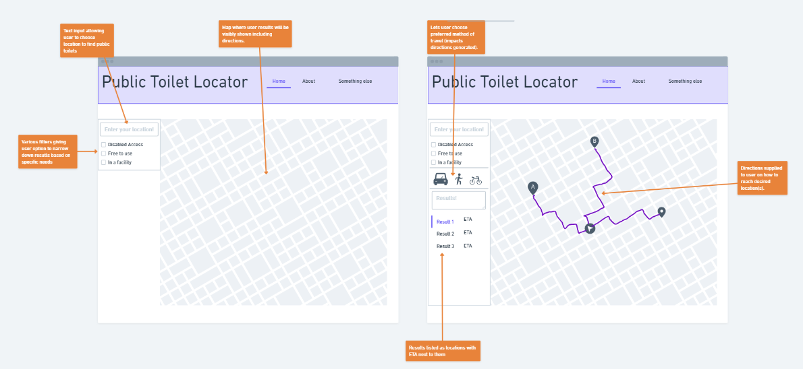

# Design

## Behavioural design
### Use Case Scenario 1
User would like to locate public toilets around *their specific location* e.g. they are outside but are in need.
 - They grant the app permission to use their current location in order to obtain results.

### User Case Scenario 2
User doesn't share their location with app e.g. want to pre-plan journey and/or would prefer to not share their location in general.
 - Do not grant app permission to user location, enter addresses/ points of interest manually.

### Use Case 2
## Scenario

## User Interface design

