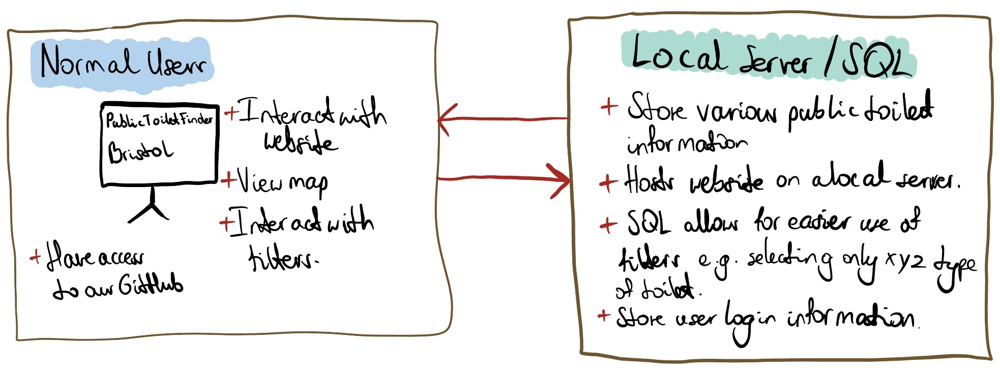

# Implementation

## Introduction
The dataset that we are using for the project is the public toilets dataset, from the Bristol Open Data website. The link can be found below:

https://opendata.bristol.gov.uk/explore/dataset/public-toilets-community/information/?location=15,51.45136,-2.59764&basemap=jawg.streets

The reason we chose this dataset is due to our belief in Bristol becoming more accessible not only to tourists but also its own citizens.

There are no known issues with this dataset.

## Project Structure

Project folder consists of multiple documents laying out our projects' Life Cycle followed by the actual code making up our website.

### Planning
This first step of the life cycle explored the necessity of the project, giving an overview of its benefits, potential drawbacks and any other limitations which may affect the targeted users as a result of inadequate dataset updates etc. 

### Requirements
Here, we used our business awareness to create multiple user case scenarios based upon intended uses of our service by our targeted user groups. 

Based on these scenarios, we came up with multiple functional as well as non functional requirements ensuring the users can comfortably use the app as intended.

### Design
Design stage included formulating a blueprint, if you will, on how the user will be able to interact with the website depending on the specific user case scenario. After that, we created a wireframe model to base the website upon which, in our case, was applicable to each user case due to the nature of our service.

### Implementation 
In this stage, we are now beginning to build the website bit by bit, setting the foundation and acting upon our previous ideas established; the wireframe, the user case scenarios, the functional requirements etc.

Using a mix of HTML/CSS/JS, we are creating the front end of the website keeping a minimalistic feel incorporating mainly light/baby blue and white as the main colours.

For the backend and database control, we used SQL and nodeJS.

 - main.html - HTML for landing page (done in regards to wireframe model)
 - main.css - CSS for landing page 
 - package.json - Contains details regarding project.
 - SQLConnection.js - allows connection to SQL Database. CSV Parsing logic used here.
 - simpleServer.js - start up server which we run our website off of.
 - public-toilets-community.csv - Public toilet data within the city of Bristol.

## Software Architecture
TODO: Describe the major components of your architecture. Are any particular architectural styles being used?

