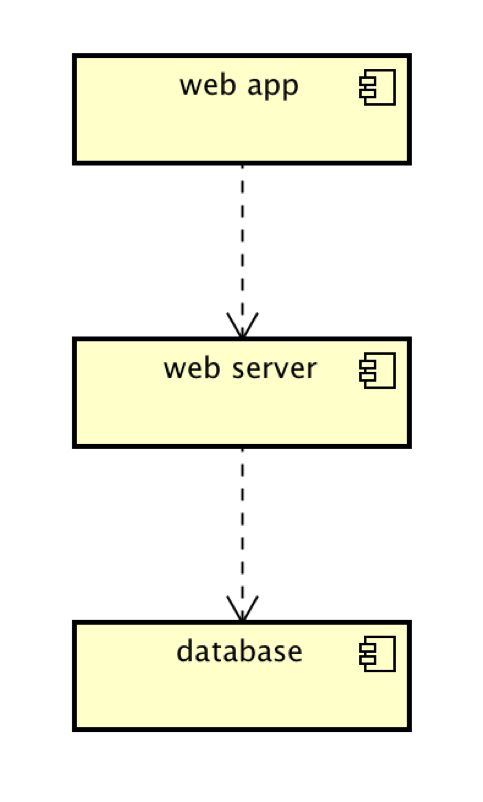

# Implementation

## Introduction
The dataset that we are using for the project is the public toilets dataset, from the Bristol Open Data website. The link can be found below:

https://opendata.bristol.gov.uk/explore/dataset/public-toilets-community/information/?location=15,51.45136,-2.59764&basemap=jawg.streets

There are no known issues with this dataset.

## Project Structure
TODO: Provide an outline of the project folder structure and the role of each file within it (not the contents of node_modules).
provide a table listing the number of jslint warnings/reports for each module.

## Software Architecture
TODO: Describe the major components of your architecture. Are any particular architectural styles being used?

