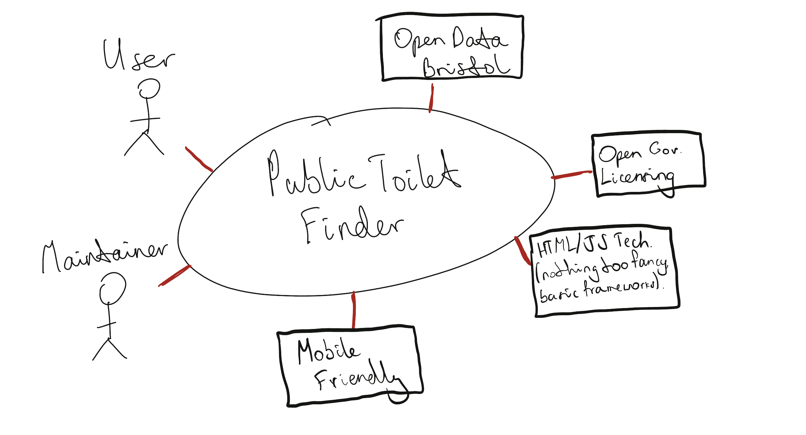

# Project Proposal

## Business Case

### Problem statement
Allow for the public, whether it be visitors or locals, of Bristol to efficiently relieve themselves whenever
outside by providing them with open data of **Public Toilets** around the city.
A barrier to new people wanting to visit the city may be they are unsure about public toilets, meaning they might be less inclined to visit. A app which presents to the public the nearest public toilet will be very beneficial to them, as well as locals.
Public toilets provide a basic necessity for people who are out and about in the city, whether they are shopping, sightseeing, or attending events. Having access to clean, safe, and accessible public toilets is important for so many reasons. 
For example, public toilets help to create a healthy and hygienic environment within the city. Having somewhere where members of the public can wash their hands can help reduce the spead of illness and viruses such as COVID-19.
Also, having a wide range of public toilets available throuhgout the city will help to boost the levels of tourism in the city. Tourists who visit will feel comfortable that they will be able to relieve themselves a any point during their visit, allowing them to spend less time worrying about that, and instead can focus on the sights of the city.

### Business benefits
Plethora of benefits in different fields:
 - Increased number of customers for businesses which have toilets open for the public.
 - Visitors from outside will be more likely to enjoy their stay and in turn return, improving economy.
 - Businesses without toilets may take the idea into consideration and implement such facilities if they see fit ( e.g. they are only business in local vicinity WITH a Public Toilet ).
 - If Bristol becomes well known for its range of public toilets, and easy accessibility using the app, then it will generate more tourism for the area, as people begin to learn how easy it is to find a toilet while exploring the city.

### Options Considered
Other options may include manually entering facilities with the intention of asking each and every one - which would not be very pleasant *especially* if you are in dire need. 
Another example may be searching online, but the information obtained would most likely be very lackluster due to the lack of precision when supplying the user with exact locations in comparison to their own, directions, time taken etc.
For some people who require the use of a public toilet, time may not be on their side. This means that having quick access to their closest toilet would be very useful.

### Expected Risks
As expected, no project is without its drawbacks. Some risks include:
 - Due to the nature of the dataset being open data ( from Bristol City Council ), it will only be updated whenever it is officially updated by the government and so some locations may be missed out.
 - Some toilets may be unhygienic to different degrees which may disappoint visitors or worse - cause health problems.
 - Misuse of these facilities may happen as is inevitable due to them being open to the public.
 - The quality and cleanliness of the toilets as before mentioned is unfortunately out of control of our team who is developing the app. This means that if a user is unhappy with the quality of their experience using the toilet then it means that even if they were to complain to us, there would be very little that we would be able to do about it.

## Project Scope
Our **Project Scope** is made up of the people utilising our service together with the tools used to develop it.

Actors:
 - Workers, Students, Public, Tourists

Systems:
 - Open Data (source of data)
 - Map integration e.g. Google/Apple maps to improve user experience

