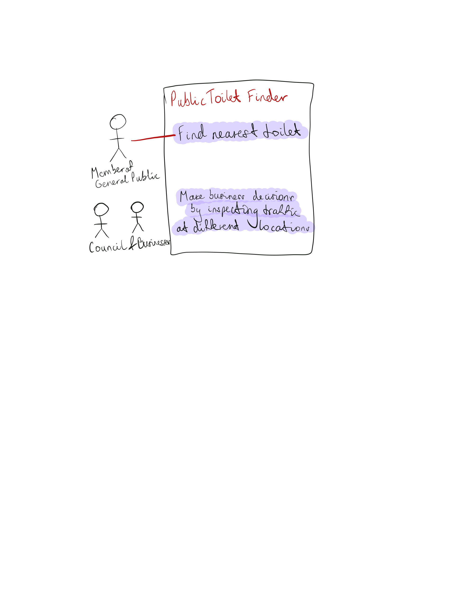

# Requirements

## User Needs

### User stories
- As a tourist visiting Bristol, I'd like the option to quickly and efficiently relieve myself when exploring the new environment so that I can spend the most time possible experiencing new things rather than stressing.
- As a student within the city, I'd enjoy having the option to easily find a toilet when outside between lessons/lectures to avoid rushing and/or stressing.
- As a taxi driver, I'd really like the option of relieving myself on the go whilst simultaneously planning the location based on customer needs to ensure the best experience for both of us.

### Actors
Citizens of Bristol (Students, Workers, Maintainers), Tourists, Council

### Use Cases

| UC1 | Users which require the toilets | 
| -------------------------------------- | ------------------- |
| **Description** | Members of general public of Bristol require the location of the nearest public toilet near them. |
| **Actors** | General Public (Students, Workers) |
| **Assumptions** | Assumption that user is already in Bristol but could be checking to plan trip.</td></tr>
| **Steps** | A: Share their location with system or B: Manually enter X location to scout nearest toilets |
| **Variations** | Users may not wish to share their data. |
| **Non-functional** | Supply the user with nearest (1 or multiple) locations of public toilets around given location provided by user. |
| **Issues** | If user is really far from a public toilet, could possibly supply with bus routes based on open data. |

| UC2 | Users which require specific toilets |
| -------------------------------------- | ------------------- |
| **Description** | People with special needs may or may not need to use specific types of toilets when outside. |
| **Actors** | Specific members of general public (parents with children, people with certain types of disabilities) |
| **Assumptions** | A parent with a young child needs to find a restroom with a changing table/ Disabled person may need a large, accessible toilet.</td></tr>
| **Steps** | A: The user gives their location OR enters manually and filters by type of toilet required. |
| **Variations** | The user may not want to share their location, not allowing them to sort by nearest |
| **Non-functional** | The app should provide accurate information on the availability and cleanliness of changing tables, as well as any additional amenities available. |
| **Issues** | The app may not have up-to-date information on restroom availability or cleanliness, or there may be a lack of restrooms with changing tables in certain areas. |

| UC3 | Observing traffic in different toilet locations |
| -------------------------------------- | ------------------- |
| **Description** | Businesses may benefit from having information on traffic through various locations |
| **Actors** | Local businesses within the area or perhaps people looking to open a business |
| **Assumptions** | Relatively accurate and recent information is available.</td></tr>
| **Steps** | People who require the information can view the toilet, in turn having the traffic of the toilet available to them. |
| **Variations** | Based on rating of toilet (along with different factors), users can view traffic in google of their given location.|
| **Non-functional** | The app should provide accurate traffic information based on different times throughout the day. |
| **Issues** | The app may not have up-to-date information on restroom traffic due to some users not allowing app to use their location. |
  

## Software Requirements Specification
### Functional requirements
 - FR1: Make use of Open Data Bristol dataset for public toilet locations on the map available.
 - FR2: Obtain a user location; whether it be *theirs* or a location given e.g. postcode.
 - FR3: Compare the user location supplied together with the distances to the nearest (e.g.) 3 toilets around them.
 - FR4: Be able to supply the user with directions to these locations AND (if applicable) tell the user the name of the facility which the toilet is inside of.

### Non-Functional Requirements
 - NFR1: Tell user change of ground level when supplying directions. (if they'll be walking up/downhill)
 - NFR2: Supply the user with an ETA.
 - NFR3: Allow users to rate different locations based on variety of properties such as:
   - Difficulty to find
   - Hygiene 
   - How busy

 - NFR4: Allow the user to choose routes based on different factors e.g.
   - Selection by special need e.g. disabled / baby 
   - Least turns
   - Not uphill and/or least level change
   - Shortest ETA
   - Least traffic (aka least busy toilet)

